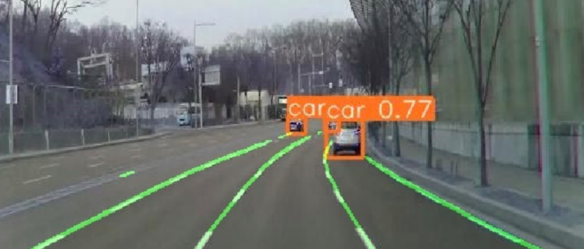
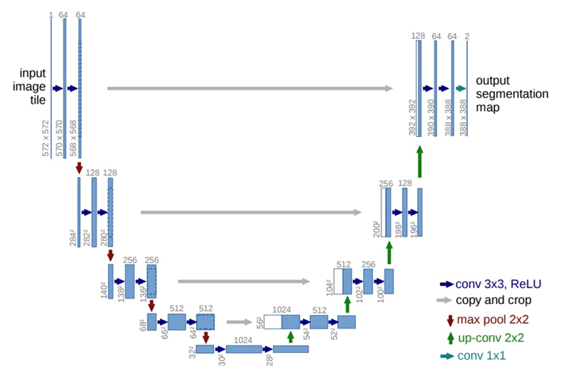
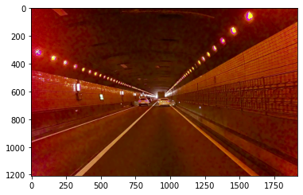
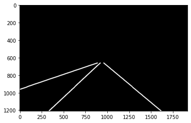
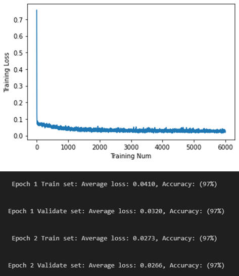
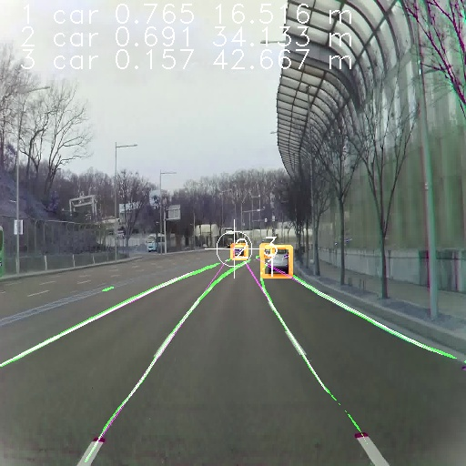
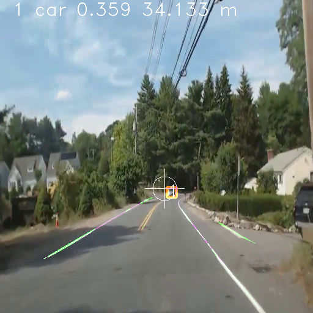
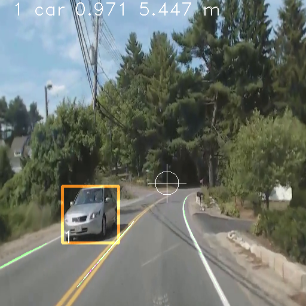
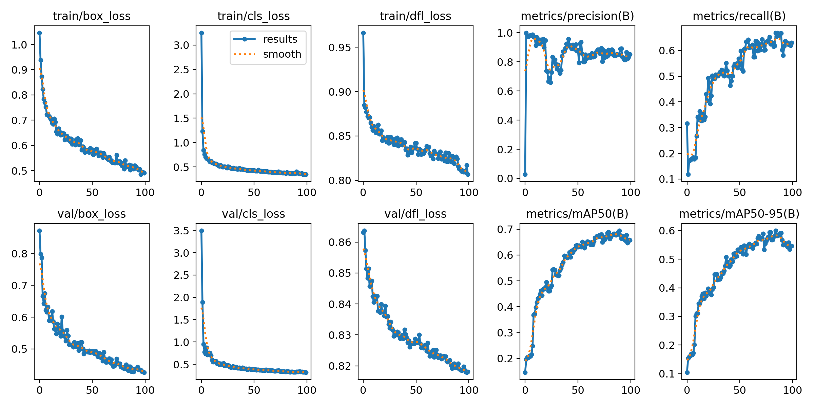
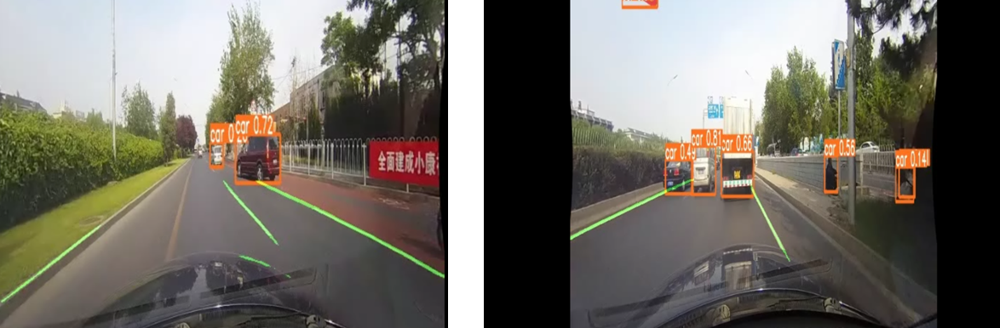

# CSSE463_Project_Car_Lane_Detection

## Introduction

We employed the U-Net model to establish a core lane detection function, which involves identifying lane lines within images. For car detection, we utilized a pre-trained Ultralytics model that leverages the YOLO algorithm. We pretrained this model to address our specific car detection task.

In the end, we integrated the two models. This combined system capitalizes on the U-Net model's lane detection capabilities to identify lane lines on the road. Concurrently, it harnesses the car detection expertise of the pre-trained YOLO model to recognize and precisely locate vehicles in the driving scene. By merging these functionalities, we created a comprehensive perception system that enhances our understanding of the road environment by detecting both lane lines and vehicles. This integrated approach significantly boosts the overall driving assistance and autonomous driving capabilities of the vehicle.

The input image size is (512, 512). The output image size is (512, 512)

### Repository Structure

> **Test**
>
> - **data**
>   - **MyDataSet.py**
> - **images** (folder for test images)
> - **unet**
>   - **unet_model.py** (U-Net Model code)
> - **weights**
>   - **best.pt** (YOLO Model)
>   - **last.pt** (YOLO Model)
> - **main.ipynb** (code for generating combined images)
> - **main.py** (similar to main.ipynb, including vanishing point and distance estimation)
> - **model.mod** (U-Net Model)
>
> **U_Net**
>
> - **data**
>   - **SDLane** (train images from dataset)
>   - **MyDataSet.py** (code for custom dataset)
>   - **ResizeImages.py** (resizes all train images to 512x512)
>   - **ReadSDLaneData.ipynb** (code for exploring SDLane dataset)
> - **unet**
>   - **unet_model.py** (U-Net Model code)
> - **predict.ipynb** (code for previewing U-Net's results)
> - **train.ipynb** (code for training U-Net Model)
> - **trainRecord.csv** (U-Net training records)
> - **validateRecord.csv** (U-Net validation records)
> - **model.mod** (U-Net Model)
>
> **YOLO**
>
> - **results**
>   - **train0.1** (training results)
>   - **train0.5** (training results)
>   - **train0.25** (training results)
> - **a.yaml** (Used for training. Store the path to training set and validate set, the number of class as "nc", names of class)
> - **label.py** (label the images in the folder. Please create the "labels" folder parallel to "images" folder before executing. Confidence level can be adjusted)
> - **train.py** (train the model with configuration in .yaml file)
> - **predict.py** (generate the image with boxes based on model using)
> - **file structure for training dataset under same folder**:
>   [path]/images/       store all images
>   [path]/labels/       store all labels in .txt file corresponding to images

### Package Requirements

> - Ultralytics: Ultralytics does not have a specific version number, as it is a repository that provides code for various object detection algorithms and tools. You can check the latest commits on their GitHub repository. 
>
>   https://docs.ultralytics.com/
>
> - PyTorch: The latest version was PyTorch 1.9.0. https://pytorch.org/get-started/locally/
>
> - Numpy: The latest version was NumPy 1.21.2.
>
> - OpenCV: The latest version was OpenCV 4.5.3.
>
> - Pillow (PIL): The latest version was Pillow 8.3.1.
>
> - Matplotlib: The latest version was Matplotlib 3.4.3.
>
> - SDLane (dataset: https://42dot.ai/akit/dataset)
>
> - Mit-Driving Seg (dataset: https://ieee-dataport.org/open-access/mit-driveseg-semi-auto-dataset)

### Hardware
RTX 3090 (24 G)

### Quick Usage

> 1. Put some images to folder Test->images
> 2. Put trained model (model.mod) to folder Test
> 3. Open file Test/main.ipynb or Test/main.py

## Lane Detection

U-Net is a convolutional neural network architecture widely used for image segmentation tasks. Its unique structure combines an encoder path, capturing context, with a decoder path for precise localization. U-Net excels in biomedical and visual applications, such as medical image analysis and road scene segmentation. The model's skip connections retain fine details while integrating high-level features, enhancing segmentation accuracy. This efficient architecture, popularized by its ability to handle limited labeled data effectively, enables U-Net to achieve remarkable results in various tasks by balancing global context understanding and fine-grained object delineation.

### U-Net Architecture

### SDLane Dataset

The SDLane dataset is a publicly available resource for advancing autonomous driving and lane detection research. It offers diverse real-world driving images with annotated lane markings, facilitating the development and evaluation of lane detection algorithms. The dataset includes various road and lighting conditions, providing a realistic training environment. With open access and compatibility with popular deep learning frameworks, SDLane supports the creation of accurate and robust lane detection models, contributing to safer and more effective autonomous driving systems.

 

### Model Performance

## Vehicle Detection

Ultralytics is a toolkit for computer vision, specializing in object detection and segmentation tasks. It's known for integrating popular frameworks like YOLO (You Only Look Once) algorithm. YOLO, a real-time object detection method, divides an image into a grid and predicts bounding boxes and class probabilities for each grid cell. This approach enables fast and accurate object detection by processing images in a single pass. Ultralytics leverages YOLO's capabilities for streamlined model training and evaluation. Together, they offer a powerful solution for rapid, precise, and efficient object detection, benefiting applications like autonomous driving, surveillance, and object recognition.

### Properties shown on image
> detected lane as green

> hough transformation line produced by the previous line as pink

> while focus circle line and circle around center as vanishing point

> boxes around the detected vehicles

> object index, confirm probability, estimated distance

### Training Model Details

**YOLO label format**:
(detection-object-index x-center-ratio y-center-ratio width-ratio height-ratio)
example label file content, where first line is the label of object "0" with box of whole image, second is box of object 1 in up left quarter

> 0 0.5 0.5 1 1

> 1 0.25 0.25 0.5 0.5

Name of classes used for vehicle detection
> {0: 'person', 1: 'bicycle', 2: 'car', 3: 'motorcycle', 4 'bus', 5: 'truck'}

### MIT-Driving Seg Dataset

> MIT DriveSeg (Semi-auto) Dataset is a set of forward facing frame-by-frame pixel level semantic labeled dataset (coarsely annotated through a novel semiautomatic annotation approach) captured from moving vehicles driving in a range of real world scenarios drawn from MIT [Advanced Vehicle Technology (AVT) Consortium](https://agelab.mit.edu/avt) data. 
>
> (cited from https://ieee-dataport.org/open-access/mit-driveseg-semi-auto-dataset)

### Model Performance

The YOLO model uses self-detected dataset for training, which would enhance the probability above the labelling threshold. However, quickly overfitting on small amount of self labelling training set may cause the inaccurate estimation comparing to the real result. 

## Future Work

Addressing the challenges ahead, our future work primarily centers on enhancing the accuracy of both U-Net and YOLO for more robust lane detection and car recognition.

For U-Net's accuracy improvement in lane detection, we plan to enrich our dataset with a wider range of road conditions, lighting, and lane variations. This increased diversity will enable the model to generalize better and handle scenarios where the yellow line is currently missed. Moreover, fine-tuning the U-Net architecture, incorporating attention mechanisms, and experimenting with advanced data augmentation techniques can contribute to better performance.

To tackle the misidentified person issue in car recognition using YOLO, we intend to curate a more comprehensive dataset that covers a wider spectrum of human poses, clothing, and lighting conditions. This dataset augmentation will aid in training the model to discern humans more accurately. Additionally, incorporating transfer learning by fine-tuning YOLO on a larger and more diverse dataset can help the model better understand contextual cues to avoid misclassifications.

Collaborative efforts involving iterative model training, thorough evaluation, and leveraging the latest advancements in deep learning techniques will be pivotal in attaining higher accuracies for both U-Net and YOLO. By refining these models, we aim to establish a robust and dependable system for lane detection and car recognition, contributing to safer and more accurate autonomous driving and object recognition applications in the future.

To handle the real-life traffic environment, lane detection and vehicle recognition should be combined to accurately identify the location of the objects on the road. Currently, the distance estimation based on label box width is implemented in our model, while the properties of the dataset camera like its height and visual angle is missing for more accurate calculation. While the vehicle shows the side part, the distance would be greatly underestimated, while the one blocked by image boundary is overestimated. 

By continuously identifying video stream dataset, through the surrounding environment as reference, it would be possible to track the moving path and velocity of the vehicles, including the observer's, and utilizing them to predict their possible movements in the following seconds. 

## References

U-Net: Ronneberger, O., Fischer, P., & Brox, T. (2015). U-net: Convolutional networks for biomedical image segmentation. In *Medical Image Computing and Computer-Assisted Intervention–MICCAI 2015: 18th International Conference, Munich, Germany, October 5-9, 2015, Proceedings, Part III 18* (pp. 234-241). Springer International Publishing.

YOLO: https://github.com/ultralytics/ultralytics

SDLane Dataset: https://42dot.ai/akit/dataset/sdlane

MIT-DriveSeg Dataset: Li Ding, Michael Glazer, Jack Terwilliger, Bryan Reimer, Lex Fridman. (2020). MIT DriveSeg (Semi-auto) Dataset. IEEE Dataport. https://dx.doi.org/10.21227/nb3n-kk46
